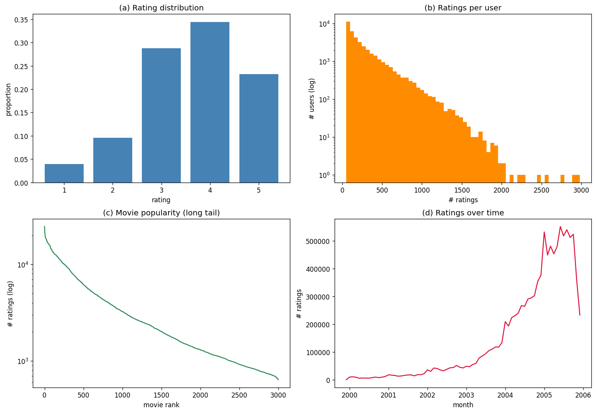

# Personalized Content Discovery — Netflix Prize Recommendation System

Submission for **Open Projects 2026** (Cultural Council, IIT Roorkee) — *Problem Statement 1: Recommendation Systems for Personalized Content Discovery*.

**Author:** Mayank Kumar Agrawal (23323021)

## Overview
A personalized movie recommendation system built on the **Netflix Prize Dataset**
(100M+ ratings, 480K users, 17.7K movies). The system learns user preferences,
predicts unseen ratings, generates ranked Top-K recommendations, and explains them.

## Approach
A progression of four models, compared head-to-head:
1. **Bias baseline** — global mean + regularized user/item biases (RMSE floor)
2. **Item-based collaborative filtering** — adjusted-cosine item similarity
3. **Matrix factorization (biased SVD)** — latent factors trained with SGD (primary model)
4. **Neural collaborative filtering** — MLP over embeddings (innovation extension)

Plus an **explainable recommendation** layer ("recommended because you liked A and B").

## Evaluation
- **RMSE** — rating-prediction accuracy
- **MAP@10** — ranking quality (a movie is relevant if its true rating ≥ 3.5)
- Also: Precision@10, Recall@10, NDCG@10, Coverage
- **Temporal train/test split** — hold out each user's most recent 20% of ratings

## Results at a glance
Dense subset: **10,699,358 ratings · 40,000 users · 3,000 movies · 8.92% density** · temporal 80/20 split · relevance ≥ 3.5.

| Model | RMSE ↓ | MAP@10 ↑ | P@10 | R@10 | NDCG@10 ↑ | Coverage ↑ | train (s) |
|-------|:------:|:--------:|:----:|:----:|:---------:|:----------:|:---------:|
| Bias baseline | 0.9039 | 0.0364 | 0.0729 | 0.0217 | 0.0731 | 0.015 | 0.7 |
| Item-based CF | 0.8838 | 0.0658 | **0.1104** | **0.0340** | 0.1223 | **0.810** | 1.6 |
| **Matrix Factorization (SVD)** | 0.8611 | **0.0720** | 0.1107 | 0.0338 | **0.1266** | 0.139 | 5.9 |
| Neural CF | **0.8419** | 0.0423 | 0.0729 | 0.0221 | 0.0817 | 0.351 | 9.7 |

**Key findings:** (1) *RMSE ≠ ranking* — NCF wins RMSE but **SVD is the best recommender** (top MAP@10/NDCG@10). (2) *Accuracy vs discovery* — Item-CF covers 81% of the catalog vs SVD's 14%. All models beat the baseline and historical Cinematch (0.9514). Hit Rate@10 = **44.5%**.

### Exploratory data analysis


> Full analysis, methodology, recommendation examples and explanations are in
> [`report/report.pdf`](report/report.pdf) and [`slides/slides.pdf`](slides/slides.pdf).
> *(GitHub may not preview PDFs inline — use the download button; the files are valid.)*

## Repository structure
```
.
├── netflix_recsys.ipynb     # Main runnable notebook (Colab) — the end-to-end demo
├── src/                      # Importable modules mirroring the notebook
│   ├── data.py               #   Data Processing Pipeline   (parse, subset, split, index)
│   ├── models.py             #   Model Training Pipeline     (baseline, ItemCF, MF, NCF)
│   ├── evaluate.py           #   Evaluation Scripts          (RMSE, MAP@10, ranking metrics)
│   └── recommend.py          #   Recommendation Generation   (Top-K + explanations)
├── report/                   # Technical report (PDF, ≤10 pages)  — Deliverable 1
├── slides/                   # Presentation (PDF, ≤8 slides)       — Deliverable 3
├── results/                  # eda.png, model_comparison.csv
├── requirements.txt
└── README.md
```

### Deliverable-component mapping
| Required component | Where |
|--------------------|-------|
| Data Processing Pipeline | `src/data.py` · notebook §1–3 |
| Model Training Pipeline | `src/models.py` · notebook §5 |
| Evaluation Scripts | `src/evaluate.py` · notebook §6 |
| Recommendation Generation Module | `src/recommend.py` · notebook §7–8 |
| Documentation | this README + in-notebook markdown + report |

## Reproducing the results
**Easiest (recommended):** open `netflix_recsys.ipynb` in [Google Colab](https://colab.research.google.com)
(T4 GPU runtime), then **Run all**:
1. Get a Kaggle API token: kaggle.com → Settings → *Legacy API Credentials* → Create Legacy API Key (downloads `kaggle.json`).
2. Upload `kaggle.json` when the first cell prompts. The dataset downloads automatically.
3. The notebook parses the data, builds the subset, trains all four models, and reports RMSE + MAP@10.

**Locally / as scripts:** `pip install -r requirements.txt`, then import the `src/` modules
(see each module's docstring). A GPU is recommended for the MF/NCF models.

### Reproducibility notes
- Fixed random seed (`42`) for user sampling and both neural models.
- Deterministic data prep (temporal split, fixed Kaggle snapshot, parameters declared in-cell).
- The only non-determinism is sub-0.005 RMSE jitter on the GPU neural models (inherent to CUDA);
  model ranking and conclusions are stable across runs.

> **Subset note:** a dense subset (top 3,000 movies × 40,000 sampled active users ≈ 10.7M ratings,
> ~9% density) is used. This is permitted by the problem statement, trains in minutes, and yields
> stronger RMSE/MAP@10 by reducing noise from cold users/items. Criteria are documented in the notebook.
